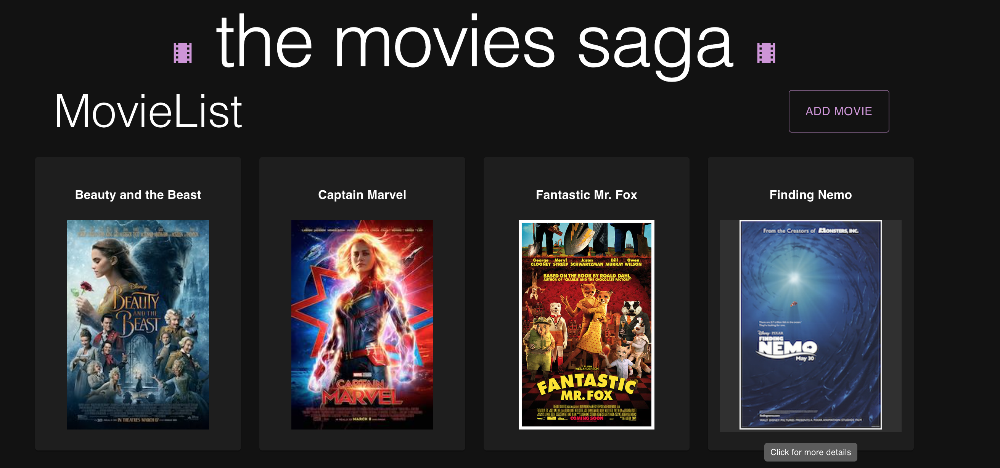
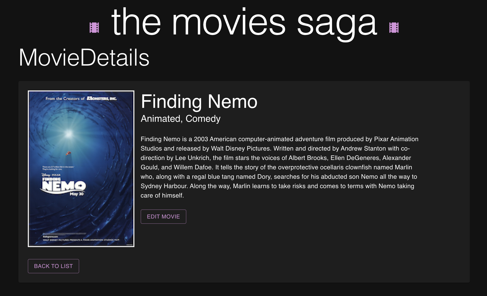
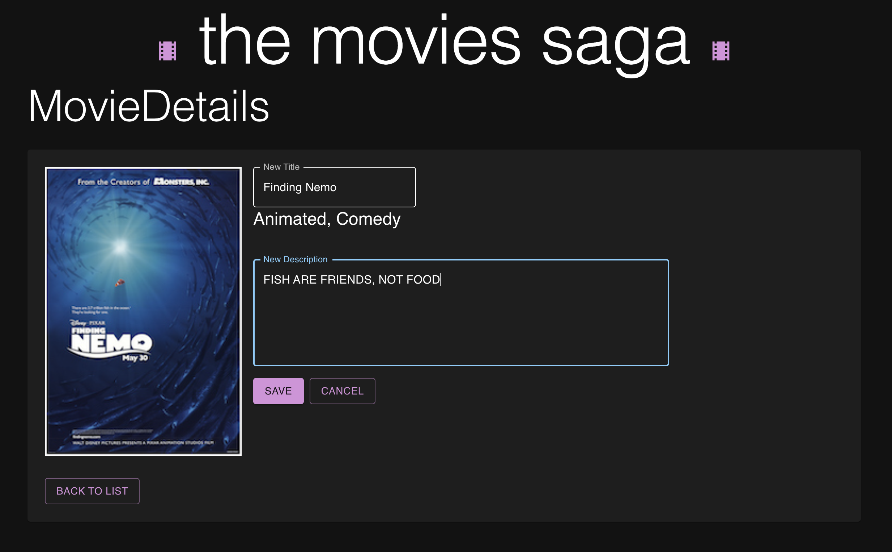
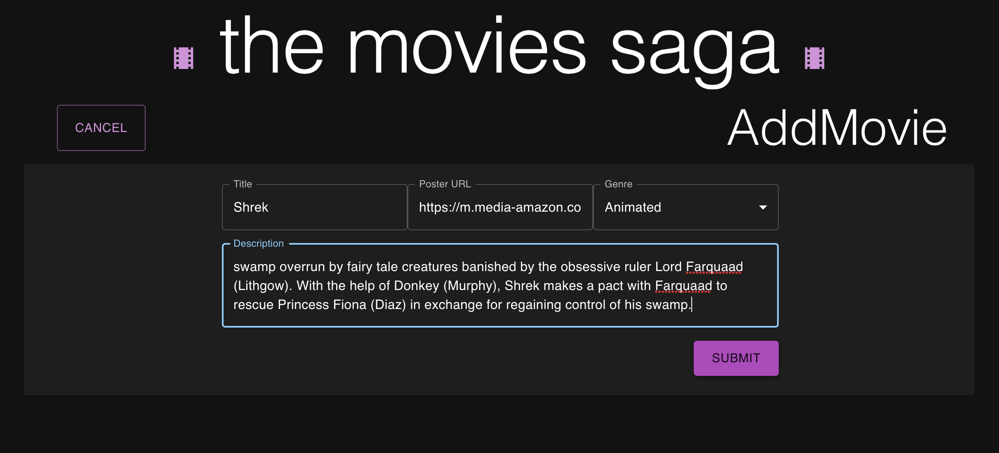

# the movies saga

## Description

Welcome to 'the movies saga,' a project created to log a collection of movies, allow the user to view and edit details of movies in the collection, as well as add new movies. The template given already had the main homepage you see (without the styling), and we were tasked to add the other functionalities seen by testing our knowledge of the previous week's lessons using Redux Sagas as well as writing SQL many-to-many JOIN statements.

## Screenshots
The MovieList home page, where a user may see the list of movies, click a poster for more details, and click the Add Movie button to go to the AddMovie page.

The MovieDetails page, where a user may view further details such as genre(s) and description, and edit the title and description of the film.

The MovieDetails page in edit mode, where a user may edit title and description.

The AddMovie page, where a user may submit a new film to the list.

## Installation
1. Create a database called `saga_movies_weekend`
2. Run the queries provided in the `database.sql` file
3. Open the project in your code editor and run an `npm i`
4. `npm run server`
5. `npm run client`

## Usage
- Click on a movie poster to view further details about the film
- Click the `EDIT MOVIE` button to switch to edit mode, where you may change the film's title or description. Click the `CANCEL` button any time to leave edit mode without committing changes, or click `SAVE` to save your changes.
- Click the `BACK TO LIST` button on MovieDetails screen to go back to the MovieList
- Click the `ADD MOVIE` button and fill out all the forms with applicable content to add a new movie. I recommend using Wikipedia for descriptions, and be sure your poster url is less than 120 characters long.

## Built with
- [React](https://react.dev)
- [Redux](https://react-redux.js.org/)
- [Redux Saga](https://redux-saga.js.org/)
- [React Router](https://reactrouter.com/en/main)
- [PostgreSQL](https://www.postgresql.org/)
- [Axios](https://axios-http.com/docs/intro)
- [Express](https://expressjs.com/)
- [Material UI](https://mui.com/material-ui/getting-started/overview/)